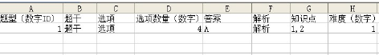

# PHPEMS介绍

# 官网
http://www.phpems.net/

# 演示网址
http://phpems.net/2014/

演示用户名/密码：guest/123456

# 功能
见 ”PHPEMS安装使用操作文档.pdf”

# CSV批量导入说明
0. 按顺序保存题目

	

1. csv文件支持GBK编码, 其他编码格式不保证.
2. 题目支持用html排版. 对于比较复杂的问答题, 可以先写进一个html文件, 浏览后如果格式正确, 则粘贴进CSV文件即可. (可参考 问答题/问答题例子.html)
3. 大家可以将题目来源加进题干, 这样可以检索到一套题的所有题目
4. 目前的难度等级为易,中,难, 对应编号1, 2, 3
5. 导入简答题时, 建议用文本直接编辑. 文本编辑时请注意用引号阔起题干来. 若题内有引号，则用两个引号表示.
6. 无法用CSV表示的题目, 请电邮我(xinyunxing0001@163.com), 我手动导入.
7. 知识点我已在http://os.cs.tsinghua.edu.cn/oscourse/OsMooc2014#head-d9b0a2239439b6205bb11de3d55e8c3ca9cdc12f标明. 请注意划分知识点和难度.

# [示例] 
见文件夹 `/CSV示例说明 `

# 备份与恢复
* 将题库导出为sql文件
mysqldump -u用户名 -p 数据库名 > 数据库名.sql
* 恢复题库
mysql -u用户名 -p 数据库名 < 数据库名.sql 

